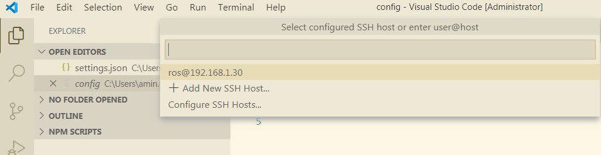
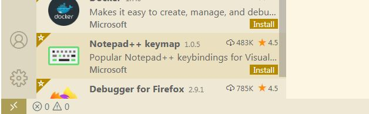
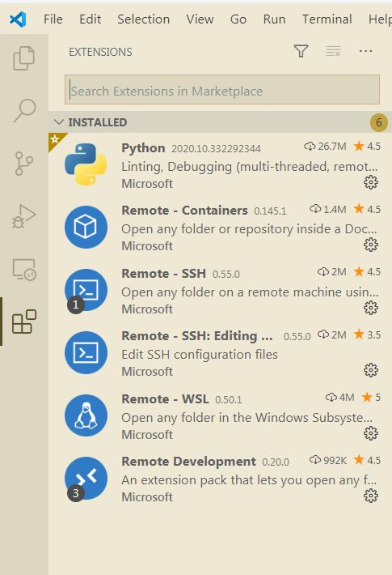
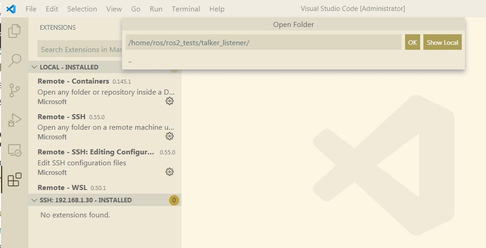
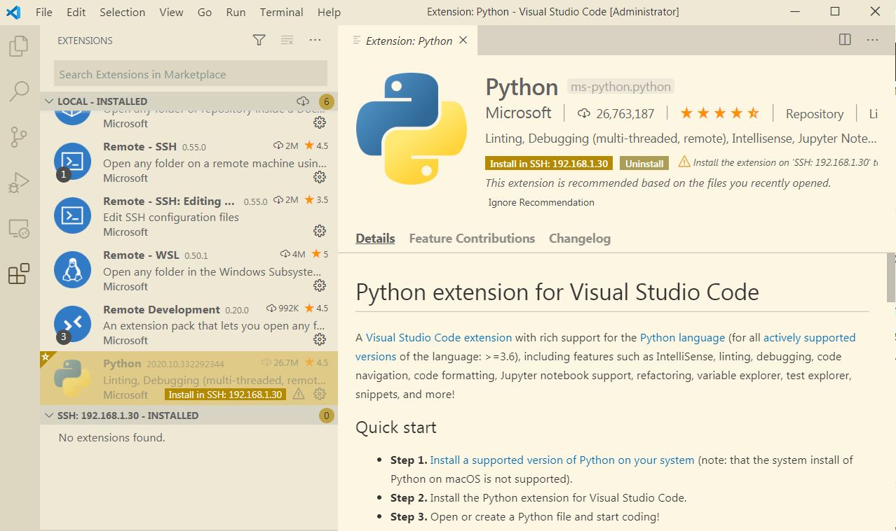

# vscode_remote_guide
Using VSCode to for remote support

# A step by step guide to use Microsoft VSCode for remote support

## Intruduction
Assume we have a fully fledged computer such as your laptop that has graphical capabilities. We would like to use this computer as a medium to get access to a remote computer that is headless. If you have used putty in windows to open a secure SSH connection to a Linux machine, this is very similar to that. But instead of putty we use VSCode. From VSCode you can browse the Linux file system and control the machine.
One useful outcome is the ability to open a code, e.g. a python code in the VSCode and enjoy the available features to edit. If you have opened a python code in nano to edit, you know how awesome this could be.
In addition, we can run a code in VSCode. We see the results in VSCode terminal but the cod is actually running on the remote Linux machine.
Last but not least, we can debug a code. The code still runs in the remote Linux machine but we can put a breakpoints in the VSCode in the windows machine and see the variables, step through the lines of the codes, etc. 

## Assumption
- The local os is Windows 7
- The remote machine is a Linux (Ubuntu 20.04) launched in VirtulBox as a VM (Virtual Machine) or an actual physical machine
## Dependencies on Linux 
Make sure the open-ssh is installed.  
check with:   
`ros@robotic:~$sudo systemctl status ssh`  
if not present, install with:  
`ros@robotic:~$sudo apt install openssh-server`
## Dependencies on Windows
 - VSCode
 After installing this extension, a new status bar is added to the left bottom of the VSCode window.  
  
- Install *git* for windows from [git download](https://git-scm.com/download/win)
This is to allow VSCode to make an SSH connection to the remote machine.
## Preparations
1. Make sure the Linux machine is running.
2. Make sure the network between Windows machine and Linux machine is set properly. For example use proper static IP addresses for the Ethernet adapters and try to ping one from the other.
3. For the rest of this tutorial, we assume the IP address of the remote Linux machine is `192.168.1.30`
4. Decide what username you want to use to connect to the Linux machine and of course you need to know the associated password. To obtain the username, in a terminal of the Linux execute:
`ros@robotic:~$whoami`
and in my case, it is going to echo `ros`.

6. Next, we make sure Windows ssh connection to Linux is working finely. 
### SSH from Windows to Linux
After installing git on windows, a terminal interface is added named Git Bash.  
During installation,  the link to it might be added to the mouse right-click menu. You can also launch it from the installation folder. for example: `C:\Program Files\Git\git-bash.exe`
In the Git Bash terminal type:  
`$ssh ros@192.168.1.30`  
in order to open an SSH connection to the Linux machine.   
If it failed with this message:
```
@@@@@@@@@@@@@@@@@@@@@@@@@@@@@@@@@@@@@@@@@@@@@@@@@@@@@@@@@@@
@    WARNING: REMOTE HOST IDENTIFICATION HAS CHANGED!     @
@@@@@@@@@@@@@@@@@@@@@@@@@@@@@@@@@@@@@@@@@@@@@@@@@@@@@@@@@@@
IT IS POSSIBLE THAT SOMEONE IS DOING SOMETHING NASTY!
Someone could be eavesdropping on you right now (man-in-the-middle attack)!
It is also possible that a host key has just been changed.
The fingerprint for the ECDSA key sent by the remote host is
SHA256:qsBf0hrU5l/4h2HWnJFSdrYIAcEVAYvJREBFUgkVpVU.
Please contact your system administrator.
Add correct host key in /h/.ssh/known_hosts to get rid of this message.
Offending ECDSA key in /h/.ssh/known_hosts:2
ECDSA host key for 192.168.1.30 has changed and you have requested strict checking.
Host key verification failed.
```
that means, you have tried to connect to another SSH server with the same IP and user before and the host verification failed because this is not the one you connected earlier. This happens for me because I have several VirtualBox images and all have the same IP and user and I switch between them from time to time.   
For remedy, we need to delete the existing key. In the warning shown above, the address of the file containing the host keys is given. In the Git Bash terminal, change the directory to:  
`$cd /h/.ssh`
And edit the file known_hosts by nano:  
`$nano /h/.ssh`  
In the nano editor, you may see several lines. find the one that begins with the remote IP address, in my case with `192.168.1.30` and delete the line:  
- To delete a line, move to beginning of line, then press `Ctrl-k`.   
- Save the file by `Ctrl-o`.   
- Confirm the name.   
- Exit by `Ctrl+x`  

Now try to open an ssh connection again:  
`$ssh ros@192.168.1.30`  
After confirming that this host is legitimate, SSH connection is established. After entering the correct password, you can control the remote machine and browse the file system. Finally, use:   
`$exit`   
to close the connection. Now it is time to connect from VSCode.
### SSH from VSCode to Linux
First we need to add the path of the SSH to the VSCode. 
- Open the Command Palette (Ctrl+Shift+P)
- Type `Open Settings (JSON)` and select it
- In the opened json file add the path of the ssh.exe inside the git installation folder. For example:
`"remote.SSH.path": "C:\\Program Files\\Git\\usr\\bin\\ssh.exe"`

Second, we establish the ssh connection to the remote machine. 
- Click on the ssh icon at the left bottom of the page to open the Command Palette. 
- Select: `Reomote-SSH: Open Configuration File ...` and choose the one that is in the User folder.
- Add the following lines to it and save it:
```
Host ros@192.168.1.30
  HostName 192.168.1.30
  User ros
  Port 22
```
- Click on the ssh icon at the left bottom of the page to open the Command Palette.  
-  Select: `Reomote-SSH: Connect To Host...` and select the host that you just added above. 
 
- It prompts you to enter the password. 
- Hopefully! the SSH connection is established now.
- When connection is successful, VSCode opens a new window to control the remote machine. So now you have two instances of the VSCode.
- The ssh icon at the left bottom of the page, shows the status.  
  
- From VSCode Terminal menu, open a terminal and browse the Linux file system.
- To close, click on the ssh icon at the left bottom of the window to open the Command Palette. Then select Close Remote Connection.

# Run and Debug code
Assume we have a python code on the remote machine. We want to see the code in an editor. In the VSCode, install the *Python extension for Visual Studio Code* to be able to edit a python code and format it properly and run it and debug it.
After installing the extension, we should see something similar to this:  
  
Please note that we intend to use the python interpreter located on the remote machine to run the code and debug it. In local machine, we just see the code and control the remote interpreter to run, debug, etc. 
## Open a python code
- From VSCode connect to the remote machine as explained before.
- Select the Explorer on the left side bar (Ctrl + Shift + E).
- From file menu, select open folder.
- Type the path to the desired folder and click Ok.  
     
- Enter the password.
- The folder is added in the Explorer pane. You can now select a file in it and open it in the editor.
## Run a python code
While connected to the remote machine using SSH, we have to install the Python extension on the remote machine too. 
- While connected, go to the Extensions pane (Ctrl+Shift+X) to see the list of available extensions on the local and remote machines. You will see that VSCode shows that the Python extension is available to install. 
  
- Select it and click on the `Install in SSH: 192.168.1.30` button.
- Open a python code as explained earlier.
- From Run menu, select *Run Without Debugging* (or press Ctrl + F5 ). As a result, the code should start running and the results should be printed in the terminal. 
- Stop the code
## Debug a python code
- Place a break point in your code.
- From Run menu, select *Start Debugging* (or press F5). 
- From the list, select:
`Python File Debug the currently active Python file`
If set properly, the code stops at the break point. Now you can do you debugging. For example, by selecting the Run on the left side bar (Ctrl+Shift+D) you can see the Variables, create Watches, see the Call Stack, etc.
Also next to the Terminal, you can use the Debug Console to read and manipulate the variables.

# Reference
[Microsoft tutorials](https://code.visualstudio.com/docs/remote/ssh)
