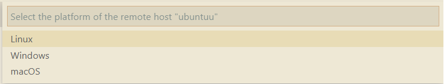
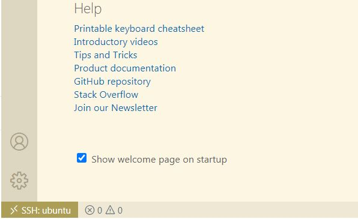
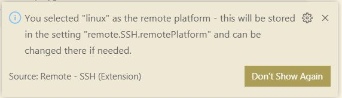
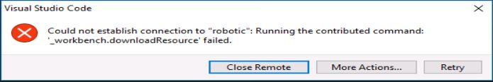

# vscode_remote_guide
Using VSCode to for remote support

# A step by step guide to use Microsoft VSCode for remote support

## Intruduction
Assume we have a computer with graphical capabilities. We would like to use this computer as a medium to get access to a remote computer that is headless. If you have used putty in windows to open a secure SSH connection to a Linux machine, this is very similar to that. But instead of putty, we use VSCode. From VSCode you can browse the Linux file system and control the machine.
One useful outcome is the ability to open a code, e.g. a python code in the VSCode and enjoy the available features to edit. If you have opened a python code in nano to edit, you know how awesome this could be.
In addition, we can run a code in VSCode. We see the results in VSCode terminal but the cod is actually running on the remote Linux machine.
Last but not least, we can debug a code. The code still runs in the remote Linux machine but we can put a breakpoints in the VSCode in the windows machine and see the variables, step through the lines of the codes, etc. 

## Assumptions
- The local os is Windows 7 or Windows 10
- The remote machine is a Linux (Ubuntu 20.04) launched in VirtulBox as a VM (Virtual Machine) or an actual physical machine
## Dependencies on Linux 
Make sure the open-ssh is installed.  
check with:   
`ros@robotic:~$sudo systemctl status ssh`  
if not present, install with:  
`ros@robotic:~$sudo apt install openssh-server`
## Dependencies on Windows
- VSCode  
- *Remote-SSH* extension in VSCode
- Install *git* for windows from [git download](https://git-scm.com/download/win)  
This is to allow VSCode to make an SSH connection to the remote machine.  
**Note:** This is needed for Windows 7. Windows 10 can have ssh capability by means of WSL (windows subsystem for linux). If you don't want to use WSL, you can install Git on Windows 10.  
## Preparations
1. Make sure the Linux machine is running.
2. Make sure the network between Windows machine and Linux machine is set properly. For example use proper static IP addresses for the Ethernet adapters and try to ping one from the other.
3. For the rest of this tutorial, we assume the IP address of the remote Linux machine is `192.168.1.30`
4. Decide what username you want to use to connect to the Linux machine and of course you need to know the associated password. To obtain the username, in a terminal of the Linux execute:
`ros@robotic:~$whoami`
and in my case, it is going to echo `ros`.

6. Next, we make sure Windows ssh connection to Linux is working finely. 
### SSH from Windows to Linux
After installing git on windows, a terminal interface is added named *Git Bash*.  
During installation,  the link to it might be added to the mouse right-click menu. You can also launch it from the installation folder. For example `C:\Program Files\Git\git-bash.exe`  
In the Git Bash terminal type:  
`$ssh ros@192.168.1.30`  
in order to open an SSH connection to the Linux machine. If connection was successful, skip the following lines and go to the next section.
If it failed with this message:
```
@@@@@@@@@@@@@@@@@@@@@@@@@@@@@@@@@@@@@@@@@@@@@@@@@@@@@@@@@@@
@    WARNING: REMOTE HOST IDENTIFICATION HAS CHANGED!     @
@@@@@@@@@@@@@@@@@@@@@@@@@@@@@@@@@@@@@@@@@@@@@@@@@@@@@@@@@@@
IT IS POSSIBLE THAT SOMEONE IS DOING SOMETHING NASTY!
Someone could be eavesdropping on you right now (man-in-the-middle attack)!
It is also possible that a host key has just been changed.
The fingerprint for the ECDSA key sent by the remote host is
SHA256:qsBf0hrU5l/4h2HWnJFSdrYIAcEVAYvJREBFUgkVpVU.
Please contact your system administrator.
Add correct host key in /h/.ssh/known_hosts to get rid of this message.
Offending ECDSA key in /h/.ssh/known_hosts:2
ECDSA host key for 192.168.1.30 has changed and you have requested strict checking.
Host key verification failed.
```
that means, you have tried to connect to another SSH server with the same IP and user before and the host verification failed because this is not the one you connected earlier. This happens for me because I have several VirtualBox images and all have the same IP and user and I switch between them from time to time.   
For remedy, we need to delete the existing key. In the warning shown above, the address of the file containing the host keys is given. In the Git Bash terminal, change the directory to:  
`$cd ~/.ssh`
And edit the file known_hosts by nano:  
`$nano known_hosts`  
In the nano editor, you may see several lines. find the one that begins with the remote IP address, in my case with `192.168.1.30` and delete the line:  
- To delete a line, move to beginning of line, then press `Ctrl-k`.   
- Save the file by `Ctrl-o`.   
- Confirm the name.   
- Exit by `Ctrl+x`  

Now try to open an ssh connection again:  
`$ssh ros@192.168.1.30`  
After confirming that this host is legitimate, SSH connection is established. After entering the correct password, you can control the remote machine and browse the file system. Finally, use:   
`$exit`   
to close the connection.
### SSH config file
Later we will use the VSCode to SSH into the remote machine and it uses the git SSH under the hood. For Windows 7, we have to define the details of the SSH session such as user, IP, port, etc. in a config file in Git Bash. Even though VSCode has a configuration file too, but it does not work for Windows 7. Another advantage of the config file is that we can define multiple SSH sessions and just use one of them by name and quickly establish the connection. 
Follow theses steps to create a config file for SSH:

 1. In Git bash terminal change the directory to `.ssh` which is in `home`  i.e. `$cd ~/.ssh`
 2. Create a config file with `$touch config`
 3. Open the config file in an editor, e.g. `$nano config`
 4. Add the necessary settings for each SSH connection. Here is an example:
 ```
 Host ubuntu
    HostName 192.168.1.30
    User ros
    Port 22
 ```
5. Save and exit the editor. 
6. When we want to SSH to the target, we use the name defined in `HOST`  in the config file. For example, in order to SSH to the target defined in the above example, simply use:  
``$ssh ubuntu``  

Here is an example of a config file with two HOST names:
```
Host ubuntu
    HostName 192.168.1.30
    User ros
    Port 22
   
Host docker
    HostName 192.168.1.30
    User root
    Port 32768
```
See the reference [Using the SSH Config File](#reference).
### Always test ssh 
Try to test the connectivity by Git Bash first. If by using Git Bash connection is still unsuccessful, check the content of the SSH config. Please note that Git Bash does not need to be running and connected to the remote machine in the background while you are using the VSCode. This is just to test that the basic requirments are met.

### SSH from VSCode to Linux
As stated in **Dependencies on Windows**, the *Remote-SSH* extension should be installed in VSCode. We can also install the *Remote Development* extension.
As a result, three extensions are added to the VSCode and one of them is *Remote-SSH*. A button is added to the left bottom of the VSCode window that allows us to access the relevent items in the Command Palette:   
   
Second, we need to add the path of the SSH to the VSCode. 
- Open the Command Palette (Ctrl+Shift+P)
- Type `Open Settings (JSON)` and select it
- In the opened json file add the path of the ssh.exe inside the git installation folder. For example:  
`"remote.SSH.path": "C:\\Program Files\\Git\\usr\\bin\\ssh.exe"`

Third, we establish the ssh connection to the remote machine. 
- Click on the ssh icon at the left bottom of the page to open the Command Palette. 
- Select: `Reomote-SSH: Connect to Host...`  
- Type the name of the desired HOST that you specified in the SSH config file. See the section **SSH config file** for details. In our example just type *ubuntu*.   
**Note:** Do not use *ssh ubuntu*  
- It asks you to seelct the platform (Linux, Windows, macOS)  
  
- It prompts you to enter the password. 
- Hopefully! the SSH connection is established now. If it failed, read the next section for some tips.
- When connection is successful, VSCode opens a new window to control the remote machine. So now you have two instances of the VSCode.
- The ssh icon at the left bottom of the page, shows the status.  
  
- It also shows the linux as the platform is added to the settings.
  
- From VSCode Terminal menu, open a terminal and browse the Linux file system.
- To close, click on the ssh icon at the left bottom of the window to open the Command Palette. Then select Close Remote Connection.  
# Connection failure
When connection is unsuccessful, an alarm message is shown. If you close it, some useful messages are printed in the OUTPUT window in VSCode (down the page there are three tabs: TERMINAL, PROBLEM, OUTPUT). By reading those messages you can figure out what wrong is. Read the following section for an example.

## vscode_server 
When you start an ssh connection for the first time, VSCode tries to install a package on the remote machine named vscode-server. That means the remote machine should have internet access. Otherwise it failes and you get an error like:  
  
If you close this window (by pressing the x), in the output window you will see some error messages indicating that VSCode attempted to download and install vscode-server.   
  
In case internet is not accessible, there is a way to download the vscode-server and install it manually. See the reference [vscode-server](#reference). Here we show how to do that.   
1- In the output window search for a "commit id". (See the picture above):  
2- Download vscode-server from url https://update.code.visualstudio.com/commit:${commit_id}/server-linux-x64/stable by replacing the comit_id with what you obtained in the output window. For this example it is:  
https://update.code.visualstudio.com/commit:622cb03f7e070a9670c94bae1a45d78d7181fbd4/server-linux-x64/stable  
3- Upload the vscode-server-linux-x64.tar.gz to the server.
4- Open a terminal in the directory where the package is (or anywhere).
5- Declare a variable in the terminal to use it in other commands: 
```$commit_id=622cb03f7e070a9670c94bae1a45d78d7181fbd4```  
6- Create a directory for the vscode-server as following:  
```$mkdir -p ~/.vscode-server/bin/${commit_id}```  
7- Unzip the downloaded vscode-server-linux-x64.tar.gz in the above directory. For example:    
```$tar zxvf vscode-server-linux-x64.tar.gz -C ~/.vscode-server/bin/${commit_id} --strip 1 ```  
8- Create an empty file with the name 0 under ~/.vscode-server/bin/${commit_id} as following:  
```$touch ~/.vscode-server/bin/${commit_id}/0```  


# Run and Debug code
Assume we have a python code on the remote machine. We want to see the code in an editor. In the VSCode, install the *Python extension for Visual Studio Code* to be able to edit a python code and format it properly and run it and debug it.
After installing the extension, we should see something similar to this:     
   
Please note that we intend to use the python interpreter located on the remote machine to run the code and debug it. In local machine, we just see the code and control the remote interpreter to run, debug, etc. 
## Open a python code
- From VSCode connect to the remote machine as explained before.
- Select the Explorer on the left side bar (Ctrl + Shift + E).
- From file menu, select open folder.
- Type the path to the desired folder and click Ok.  
     
- Enter the password.
- The folder is added in the Explorer pane. You can now select a file in it and open it in the editor.
## Run a python code
While connected to the remote machine using SSH, we have to install the Python extension on the remote machine too. 
- While connected, go to the Extensions pane (Ctrl+Shift+X) to see the list of available extensions on the local and remote machines. You will see that VSCode shows that the Python extension is available to install. 
  
- Select it and click on the `Install in SSH: 192.168.1.30` button.
- Open a python code as explained earlier.
- From Run menu, select *Run Without Debugging* (or press Ctrl + F5 ). As a result, the code should start running and the results should be printed in the terminal. 
- Stop the code
## Debug a python code
- Place a break point in your code.
- From Run menu, select *Start Debugging* (or press F5). 
- From the list, select:
`Python File Debug the currently active Python file`
If set properly, the code stops at the break point. Now you can do you debugging. For example, by selecting the Run on the left side bar (Ctrl+Shift+D) you can see the Variables, create Watches, see the Call Stack, etc.
Also next to the Terminal, you can use the Debug Console to read and manipulate the variables.

# Reference
[Remote Development using SSH](https://code.visualstudio.com/docs/remote/ssh)  
[Remote SSH: Tips and Tricks](https://code.visualstudio.com/blogs/2019/10/03/remote-ssh-tips-and-tricks)  
[Using the SSH Config File](https://linuxize.com/post/using-the-ssh-config-file/)  
[vscode-server](https://stackoverflow.com/a/57601121/11845240)   
[Using the SSH Config File](https://linuxize.com/post/using-the-ssh-config-file/)
